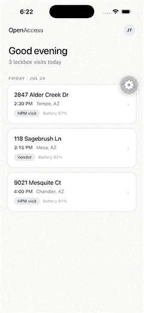

# OpenAccess

An iPhone app for finding and unlocking OpenAccess lockboxes, built with
Expo (React Native). Recreates the OpenAccess v2 design with:

- **Today** — your scheduled lockbox visits (demo data)
- **Profile** — vendor identity card, opened by tapping the avatar (demo data)
- **En Route** — real Apple Maps + live GPS tracking to the selected home
- **Finder** — real BLE radar: scans for the Arduino lockbox and turns its
  RSSI into a live distance estimate with haptic feedback
- **Unlock** — hold-to-unlock; writes a BLE characteristic so the Arduino
  reacts on its LED matrix

## Demo

<p align="center">
  
</p>

Today's visits → en route with the lockbox preview → the finder radar
counting down from 19 m → hold-to-unlock → lid released with the access log.

Recorded on the iOS Simulator, which has no Bluetooth, so the Finder screen
falls back to a simulated signal (the screen says so). On a real iPhone those
distances come from the Arduino's RSSI.

## Hardware: Arduino Uno R4 WiFi

Flash `arduino/openaccess_lockbox/openaccess_lockbox.ino` using the Arduino
IDE:

1. Install the **Arduino UNO R4 Boards** core (Boards Manager) and the
   **ArduinoBLE** library (Library Manager).
2. Select *Arduino Uno R4 WiFi* and upload the sketch.
3. The board advertises as `OpenAccess-LB`; its LED matrix shows a padlock,
   and plays an open animation when the app unlocks it.

## Running the app on your iPhone

GPS and Bluetooth both require a real device, and BLE does not work in Expo
Go — this app uses a custom dev client.

Prerequisites: **Xcode** (full install from the App Store, not just command
line tools), **CocoaPods** (`brew install cocoapods`), and your iPhone
connected via USB with developer mode enabled.

```bash
npm install
npx expo run:ios --device
```

Pick your iPhone when prompted. With a free Apple ID, set your team in
Xcode (open `ios/OpenAccess.xcworkspace` → Signing & Capabilities) the
first time; the install is valid for 7 days before it needs a rebuild.

Once installed, subsequent JS-only changes just need `npx expo start` —
no rebuild.

## Pointing the demo at your own house

Home addresses and map coordinates live in `src/data/demo.ts`. Set one of
the `coord` values to a location near you to try real GPS guidance, and
walk toward your Arduino to watch the Finder distance drop.

## Tuning the BLE distance estimate

`src/ble/useLockboxScanner.ts` converts RSSI to meters with a path-loss
model. If distances read consistently high or low, adjust:

- `TX_POWER_AT_1M` — measure the app's dBm readout while standing 1 m from
  the board and use that value (typically −55 to −65).
- `PATH_LOSS_EXPONENT` — ~2.0 for open space, up to ~3.0 indoors.

The unlock range threshold (2 m) is `IN_RANGE_THRESHOLD_M` in
`src/data/demo.ts`.
